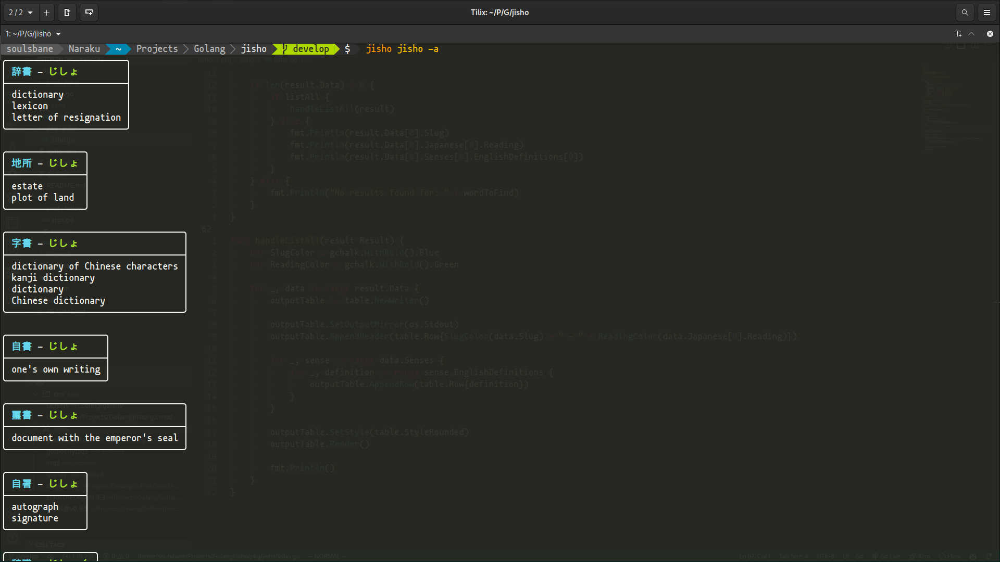

# Description

Gets the definition, reading and kanji for the given romaji input. I wanted something simple
that I could call from the command line with my dropdown terminal really quickly.

## Caveats

Does not support Kana or Kanji input. Latin characters only.

## Example Terminal Output

